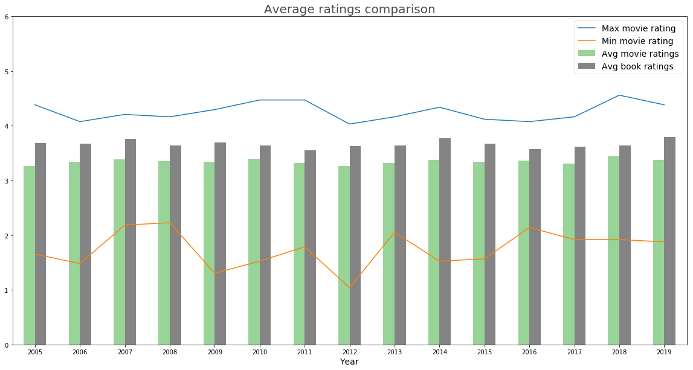
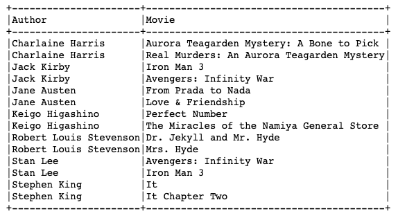

# EDA on books adapted movies.
**How do Movies perform compared to Books they were adapted from?**
 Janki Chauhan
 
[Linkedin](https://www.linkedin.com/in/jankichauhan/) | [Github](https://github.com/jankichauhan) | [Goodreads](https://www.goodreads.com/jankichauhan)

## Contents

* [Motivation](#motivation)
  * [Question](#question)
* [Data Exploration](#data-exploration)
  * [Pipeline](#pipeline-source)
  * [Analysis](#analysis)
    * [Adpated movies count](#movies)
    * [By Genres](#genres)
* [Hypothesis Testing](#hypothesis-testing)
  * [Distribution](#distribution)
  * [t-test](#t-test)
* [Conclusion](#conclusion)
* [Future Analysis](#future-analysis)

## Motivation
It was my husband who got me into reading; it started with Harry Potter books and now I read 20 books a year. (That's my goodreads reading challange too) After I finish a book, I usally discuss it with my husbands and other friends who have already read the same. It was during one of such conversation when it occurred to me, do movies receive similar or better ratings than the books they are adapted from. It will be a good data analysis project! That conversation also brought another two intresting questions: are the books sales go high after the adapted movie was released? Do number of book reviews/ratings increase i.e. more people read the book after the adapted movie was released.

### Question
During this project I wil be exploring data related to movies that were adapted from books. I am looking to get some data to answer my question : 'Do movies that are adapted from books receive similar or better ratings'

## Data Exploration
I am using Imdb dataset(as .tsv files) and Goodreads api to get information on individual books.
### Pipeline

[Goodreads API](https://www.goodreads.com/api)

[Imdb dataset](https://www.imdb.com/interfaces/)

### Analysis
Imdb dataset contains four main tables:
> - Imdb all: All infomation related movies, tv shows and shorts Imdb tracks. (# of rows: 6,737,752)
> - Ratings: Average ratings(out of 10) and number of votes. (# of rows: 1,022,316)
> - Crew infomation: Basic information of people related to movies e.g wirter, director, ... etc. (# of rows: 9,999,865)
> - Principal crew: Mapping of movie id to crew ids. It is one to manny relation. (# of rows: 38,643,725)
    
After cleaning and filtering my dataset contained movies and tv movies released between 2005 to 2019 with more than 100 votes joined with the writer(s) associated with the resepective movie. I get information about the book from writer's job description. (# of rows: 52,779)

Filtering for adapted movies narrowed my data to 2,443 rows. Uses the books name from adpated movie list to do GET by title API(goodreads) call and got back 1,870 books. 

#### Adapted movies count

#### By Genres

## Hypothesis Testing
***"Do movies that are adapted from books receive similar or better ratings"***

> - Null Hypothesis: Books have same or less ratings compare to movie adaption
> - Alternate Hypothesis: Books receive better ratings compare to movie adaption.

### t-test
> - SampleA: Books avg ratings
>> - SampleA mean: 3.7             
>> - SampleA standard deviation: 0.6
> - SampleB: Movies avg ratings
>> - SampleB mean: 3.2              
>> - SampleB standard deviation: 0.2
> - Standard error: 0.066
> - α : 0.05
> - p-value : 0.00013

## Conclusion
>  as the p-value is less the α we can successfully reject the null hyothesis. Hence books receive better ratings compare to respective movie adaptation. 

## Fun Fact
> - Authors with most movies adapted from their books(top 2 movies)

> - Goodreads has 90 million members registered users, while imdb has 83 million registered user; though Imdb has been around longer(since 1990).
> - Both Goodreads and Imdb are Amazon subsidaries. 

## Future Analysis
As I mentioned in motivation, it will great to see if the effect of movies(once they release) on the sales and number of reader of books. 

Imdb don't have revenue information for each movie. Given more time, it would be intresting to compare the revenue of movies that were adpated from books vs movie with original screenplay.

Looking at the graphs, why there is dip in number of movies in 2018 and 2019? Was it because of #MeToo movement?
