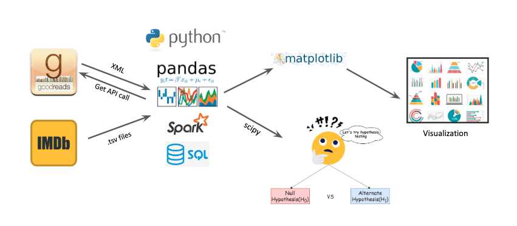
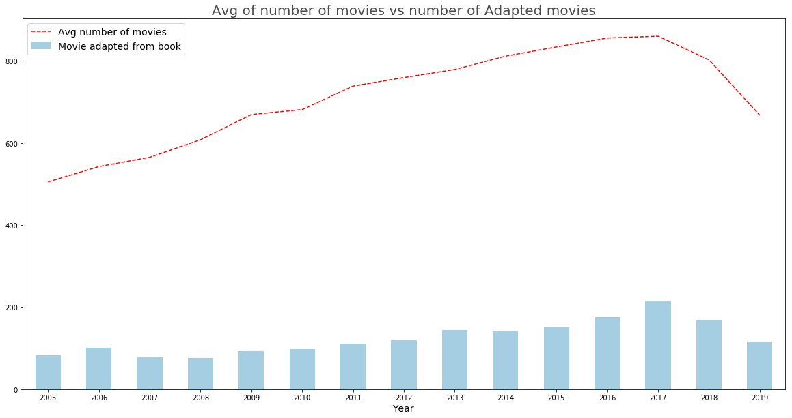
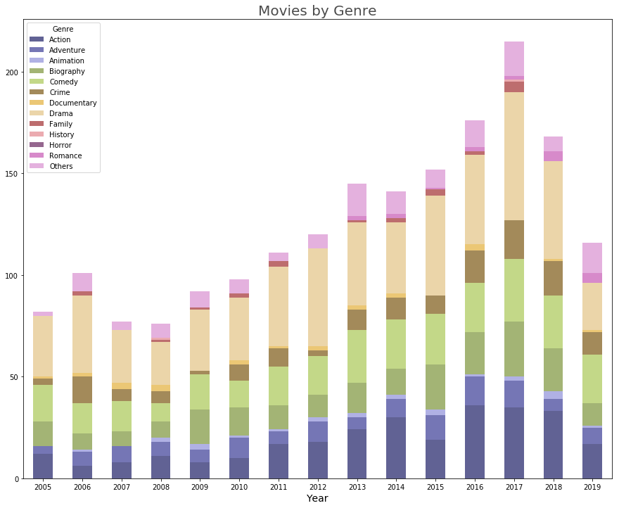

# EDA on books adapted movies.
**How do Movies perform compared to Books they were adapted from?**
 Janki Chauhan
 
[Linkedin](https://www.linkedin.com/in/jankichauhan/) | [Github](https://github.com/jankichauhan)

## Table of Contents

* [Motivation](#motivation)
  * [Question](#question)
* [Data Exploration](#data-exploration)
  * [Pipeline](#pipeline-source)
  * [Analysis](#analysis)
    * [Adpated movies](#movies)
    * [Genres](#genres)
* [Hypothesis Testing](#hypothesis-testing)
  * [Distribution](#distribution)
  * [t-test](#t-test)
* [Conclusion](#conclusion)
* [Future Analysis](#future-analysis)

## Motivation
It was my husband who got me into reading; it started with Harry Potter books and now I read 20 books a year. (That's my goodreads reading challange too) After I finish a book, I usally discuss it with my husbands and other friends who have already read the same. It was during one of such conversation when it occurred to me, do movies receive similar or better ratings than the books they are adapted from. It will be a good data analysis project! That conversation also brought another two intresting questions: are the books sales go high after the adapted movie was released? Do number of book reviews/ratings increase i.e. more people read the book after the adapted movie was released.

### Question
During this project I wil be exploring data related to movies that were adapted from books. I am looking to get some data to answer my question : 'Do movies that are adapted from books receive similar or better ratings'

## Data Exploration
I am using Imdb dataset(as .tsv files) and Goodreads api to get information on individual books.
### Pipeline

[Goodreads API](https://www.goodreads.com/api)

[Imdb dataset](https://www.imdb.com/interfaces/)

### Analysis
Imdb dataset contains four main tables:
    * Imdb all: All infomation related movies, tv shows and shorts Imdb tracks 
    * Ratings: Average ratings(out of 10) and number of votes
    * Crew infomation: Basic information of people related to movies e.g wirter, director, actors ... etc
    * Principal crew: Mapping of movie id to crew ids. It is one to manny relation. 
After cleaning and filtering my dataset contained movies and tv movies released between 2005 to 2020 with more than 100 votes joined with the writer(s) associated with the resepective movie. I get information about the book from writer's job description. 
#### Adapted movies

#### Genres

## Hypothesis Testing
***"Do movies that are adapted from books receive similar or better ratings"***

* Null Hypothesis: Books have same or else ratings compare to movie adaption
* Alternate Hypothesis: Books received better ratings compare to movie adaption.

### Distribution
First lets see the distribution of original data. 

### t-test
SampleA: Books avg ratings, SampleB: Movies avg ratings

SampleA mean:              SampleA standard deviation:

SampleB mean:              SampleB standard deviation:

## Conclusion

## Future Analysis
